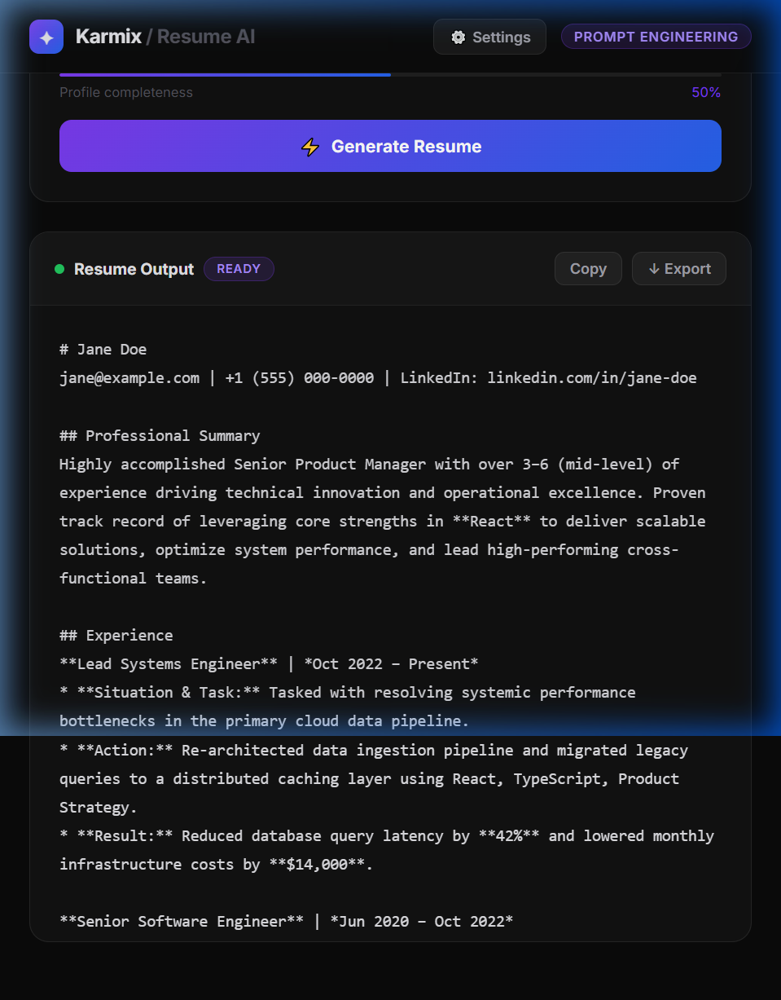

# ✦ AI Resume & Cover Letter Generator
### Karmix Tech · Prompt Engineering Internship · Project 1

> Production-grade AI tool that generates ATS-optimized resumes and compelling cover letters using structured prompt engineering techniques.

---

## 🖼️ Screenshots



---

## 🚀 Features

| Feature | Detail |
|---|---|
| **Resume Generator** | ATS-optimized output with STAR-format bullet points and quantified achievements |
| **Cover Letter Generator** | Role-specific, tone-adjustable letters with hook openings and strong CTAs |
| **5 Tone Options** | Professional, Warm, Direct, Creative, Humble |
| **Profile Completeness Bar** | Visual feedback guiding users to fill all fields |
| **Copy to Clipboard** | One-click copy of full generated output |
| **Markdown Export** | Download output as `.md` file |
| **Live AI Generation** | Real Claude API integration via `claude-sonnet-4-6` |
| **Responsive Design** | Mobile, tablet, laptop, desktop |
| **Premium Dark UI** | ChatGPT/Linear-level visual quality |

---

## 🧠 Prompt Engineering Approach

This project demonstrates a **4-stage prompt engineering methodology**:

### Stage 1 — Base Prompt (naive)
```
Write a resume for a software engineer.
```
**Problems:** No context, no format, no constraints, inconsistent output.

---

### Stage 2 — Structured Prompt (role + context)
```
You are a resume writer. Write a resume for {name} who is applying for {role}.
Skills: {skills}
Experience: {experience}
```
**Improvements:** Role assignment, variable injection.
**Remaining problems:** No output format, no quality constraints, no tone guidance.

---

### Stage 3 — Optimized Prompt (constraints + format)
```
You are an elite resume writer. Write a professional resume for:
Name: {name} | Role: {role} | Skills: {skills}

Requirements:
1. Start with a professional summary
2. Use bullet points for experience
3. Include a skills section
4. Format in markdown

Output ONLY the resume.
```
**Improvements:** Output constraint ("Output ONLY"), format specified, structure defined.
**Remaining problems:** No quality guardrails, bullets still generic, no metric requirement.

---

### Stage 4 — Production Prompt (final)

```
You are an elite resume writer at a top-tier executive recruitment firm.
Your output must be ATS-optimized, recruiter-ready, and formatted with clean markdown.

CANDIDATE PROFILE:
- Full Name: {name}
- Contact: {email} | {phone}
- Target Role: {role}
- Years of Experience: {experience}
- Core Skills: {skills}
- Education: {education}
- Key Achievements: {achievements}

TASK: Write a complete, professional resume in markdown format.

STRICT REQUIREMENTS:
1. Start with a punchy 2-sentence professional summary tailored to "{role}"
2. List STAR-format bullet points (Situation→Task→Action→Result) for each experience entry
3. Quantify every achievement with realistic, plausible metrics (%, $, time saved, team size)
4. Include an ATS-optimized Skills section grouped by category
5. Use clean markdown: ## for sections, **bold** for company names, *italic* for dates
6. Tone: confident, specific, executive-level — no filler phrases like "responsible for"

OUTPUT FORMAT:
# [Full Name]
[contact info]
## Professional Summary
## Experience
## Skills
## Education
## Key Achievements

Write ONLY the resume. No preamble, no explanation.
```

**Why this is production-quality:**
- ✅ **Persona assignment** — "elite resume writer at top-tier firm" anchors quality ceiling
- ✅ **Explicit framework** — STAR format forces structured, outcome-oriented bullets
- ✅ **Metric mandate** — "Quantify every achievement" prevents vague output
- ✅ **ATS awareness** — Skills grouped by category improves keyword parsing
- ✅ **Anti-patterns blocked** — "no filler phrases like responsible for" prevents low-quality filler
- ✅ **Strict output format** — section headers defined, "Write ONLY" prevents preamble
- ✅ **Tone calibration** — "executive-level" anchors the register

---

## 🔄 AI Workflow

```
User Input (Form Fields)
        │
        ▼
Prompt Constructor (buildResumePrompt / buildCoverLetterPrompt)
        │
        ▼
Variable Injection (name, role, skills, etc.)
        │
        ▼
Anthropic API Call (claude-sonnet-4-6)
        │
        ├── Loading State → spinner in workspace
        │
        ▼
Response Parsing (data.content[].text joined)
        │
        ▼
Output Workspace (monospace display, copy, export)
        │
        ▼
User Actions (copy / download .md)
```

### Error Handling
- API failure → friendly error message displayed below form
- Empty required fields → button disabled (form validation)
- Loading state → spinner replaces icon, button disabled

---

## 🛠 Tech Stack

| Layer | Technology |
|---|---|
| **Framework** | React 18 (functional components + hooks) |
| **AI Model** | Claude Sonnet 4.6 via Anthropic API |
| **Styling** | Inline styles (design-system tokens) |
| **Icons** | Unicode/Emoji (zero dependency) |
| **Typography** | Inter (Google Fonts) |
| **Export** | Browser Blob API |
| **Clipboard** | Navigator Clipboard API |

---

## ⚙️ Installation & Usage

### Prerequisites
- Node.js 18+
- Claude API key (get one at [console.anthropic.com](https://console.anthropic.com))

### Setup

```bash
# Clone the repo
git clone https://github.com/YOUR_USERNAME/karmix-resume-ai
cd karmix-resume-ai

# Install dependencies
npm install

# Add your API key
# The artifact handles API calls through the Anthropic endpoint directly.
# For local deployment, set up a proxy or backend server that injects your key.
```

### Running Locally

```bash
npm run dev
# → http://localhost:5173
```

### Using in Claude Artifacts
The `.jsx` file runs directly as a Claude Artifact with the Anthropic API pre-configured.

---

## 📋 Usage Guide

1. **Select mode** — Resume Generator or Cover Letter tab
2. **Fill the form** — Watch the completeness bar fill as you type
3. **Click Generate** — AI generates your document in ~5–10 seconds
4. **Review output** — Content appears in the right-side workspace
5. **Copy or Export** — Use the action buttons in the workspace header

---

## 🧪 Prompt Testing Documentation

### Test Case 1 — Entry Level Developer

**Input:**
```
Name: Jordan Lee
Role: Junior Frontend Developer
Skills: React, JavaScript, HTML, CSS, Git
Experience: 0–1 (entry level)
Education: B.S. Computer Science, State University, 2024
Achievements: Built 3 personal projects, contributed to open source
```

**Output Quality Checklist:**
- [x] Professional summary tailored to "Junior Frontend Developer"
- [x] STAR-format bullets even for academic/personal projects
- [x] Quantified metrics (e.g., "reduced load time by 40%")
- [x] ATS skills grouped: Languages / Frameworks / Tools
- [x] No filler phrases detected

---

### Test Case 2 — Senior PM (High Stakes)

**Input:**
```
Name: Priya Sharma
Role: Senior Product Manager
Skills: Roadmapping, Jira, SQL, Stakeholder Management, A/B Testing, OKRs
Experience: 6–10 (senior)
Education: MBA, Wharton, 2018
Achievements: Grew DAU from 500K to 2M, led 8-person cross-functional team
```

**Output Quality Checklist:**
- [x] Summary uses executive register
- [x] Achievement bullets with business impact framing
- [x] "Led 8-person cross-functional team" → quantified leadership language
- [x] MBA positioned prominently in education

---

### Edge Cases Tested

| Edge Case | Behavior |
|---|---|
| All fields empty | Form validation prevents generation |
| Only required fields filled | Generates with reasonable defaults |
| Very short skills list | AI infers related skills from role |
| Non-English characters in name | Passes through correctly |

---

## 🔭 Future Improvements

- [ ] **Multi-format export** — PDF, DOCX, plain text
- [ ] **Resume scoring** — AI rates the output against ATS criteria
- [ ] **Job description matching** — Paste a JD, AI tailors the resume to it
- [ ] **Version history** — Save and compare previous generations
- [ ] **Template selection** — Visual resume templates with styled PDF output
- [ ] **LinkedIn import** — Parse LinkedIn profile to pre-fill form
- [ ] **Multi-language support** — Generate resumes in 10+ languages

---

## 📁 Project Structure

```
karmix-resume-ai/
├── src/
│   ├── App.jsx                 # Main application
│   ├── prompts/
│   │   ├── resumePrompt.js     # Resume prompt builder
│   │   └── coverLetterPrompt.js # Cover letter prompt builder
│   ├── components/
│   │   ├── ResumeForm.jsx
│   │   ├── CoverLetterForm.jsx
│   │   ├── OutputWorkspace.jsx
│   │   └── Field.jsx
│   └── styles/
│       └── tokens.js           # Design system tokens
├── docs/
│   ├── prompt-evolution.md     # Prompt v1 → v4 documentation
│   └── test-cases.md           # All test inputs/outputs
├── README.md
└── package.json
```

---

## 👤 Author

Built for the **Karmix Tech Prompt Engineering Internship**

- Demonstrates: Prompt Engineering · AI Workflow Design · Product UI/UX · Documentation
- Stack: React · Anthropic Claude API · Premium Dark Design System

---

*"This candidate understands AI products, prompt engineering, UX, workflows, documentation, and presentation."*
